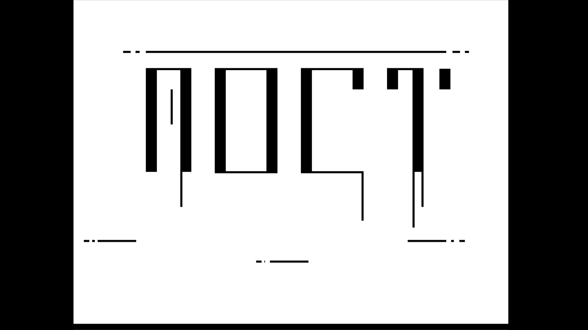

# Moct
This is the source code for Moct.

  

      Moct is a turn-based adventure game, made using C++ and the GRAPHICS.H library.
  

  
  
  
  
  <h1> Gallery </h1>
  <h3> This is a gallery for Moct </h3>
  
  <h6>
      The player represents a band of misfits called “The Moct”. They have to fight through and clear a forest infested with alien chieftains and their goons, so that they may live peacefully as outlaws in it.
  </h6>
  
   
  

      1. The main menu screen, used to navigate to the map, inventory, database and to quit the game. 
         
      The code can be found in MENU.cpp
  

  
  
   
  

      2. Various map prototypes, designed for the player to navigate through. The blue boxes are common goons. The red circles are the chieftains.
         
      The code can be found in MAP1.cpp, MAP2.cpp and MAP3.cpp
  

  
  
  
  
   
  

      3. The chieftain sprites.
         
      The code can be found in SPRITE.cpp
  

  
  
  
   
  

      4. Various fight screen UI prototypes. The final UI shows up when a battle begins.
         
      The code can be found in FIGHTBASIC.cpp, FIGHTUI1.cpp, FIGHTUI2.cpp and FIGHTUI3.cpp
  

  
  
  
  
  
   
  

      5. The shop screen. The player can buy weapons, resources to replenish health, etc.
         
      The code can be found in SHOP.cpp
  

  
  
   
  

      6. The inventory screen. The player can review the items various characters have equipped, the items in store and the gold left.
         
      The code can be found in INVENT.cpp
  

  
  
   
  

      7. A dummy loading screen. Could be used if some data was required to be loaded.
         
      The code can be found in MAIN.cpp
  

  
  
   
  

      8. The credits screen.
         
      The code can be found in CREDITS.cpp
  

  
  
   
  

      9. Health bar animation testing file.
         
      The code can be found in HP.cpp
  

  
  
   
  

      10. Some dialogue box tests.
         
      The code can be found in BLDIALOG.cpp, BRDIALOG.cpp and POPUPD.cpp
  

  
  
  
  
   
  

      11. Some helper files:
       
        - Color picker class
       
        - Shape fillstyle class
         
      The code can be found in STCOLOR.cpp and FILLSTYL.cpp
  

  
  
  
  
  
  <h1> Prerequisites </h1>
  <ul>
      <li>
        <a href='https://turbo-c.soft32.com/free-download/?nc&dm=3#google_vignette'> TURBO C++ IDE </a>
      </li>
  </ul>
  
  
  
  <h1> Getting Started </h1>
  

      1. Download and extract all the .cpp files from the project inside C:\TURBOC3\BIN
  

  
  

      2. After installing TURBO C++, start it up. It is generally found in C:\TURBOC3\Turbo C++. The executable file name is Turbo C++.exe
  

    
  

      3. Navigate through all the files. Shortcut for compilation: Alt+F9. Shortcut for execution: Ctrl+F9. ENJOY! (There are tons of bugs :) )
  

  
  
  
  <h1> Deployment </h1>
  

      There is no implementation for a sophisticated deployment system. 
      One can pack and encrypt all files in order as a .zip file, to make it a faux-deployed application.
  

   
   
   
  <h1> Co-authors </h1>
  

      <a href='https://github.com/edgeemperor'> Sanpreet Singh Gill </a>
  

   
   
   
  <h1> Acknowledgments </h1>
  

      The internet. Google. The built-in documentation for GRAPHICS.H in Turbo C++.
  

